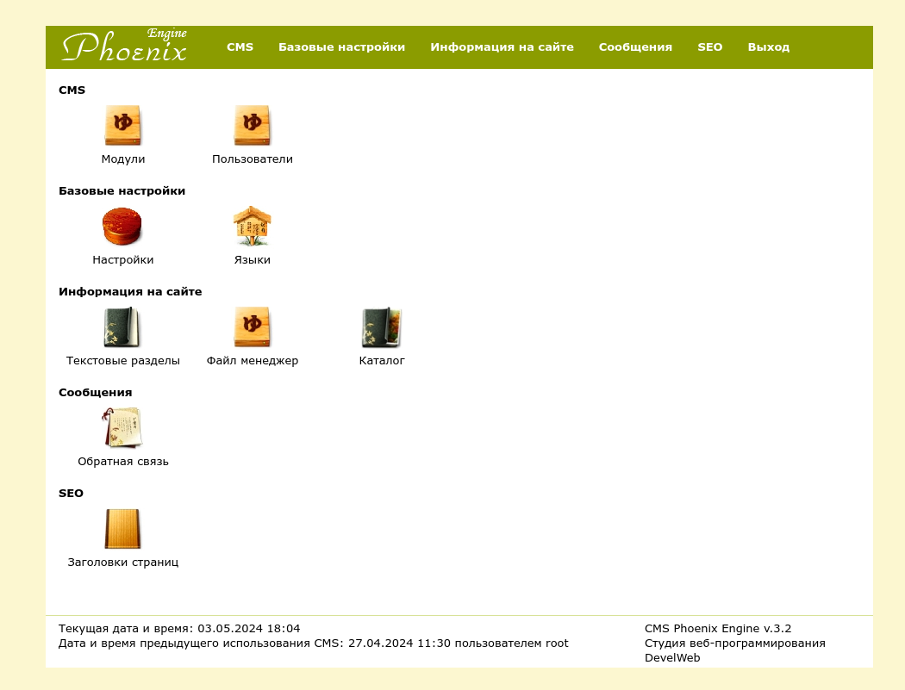
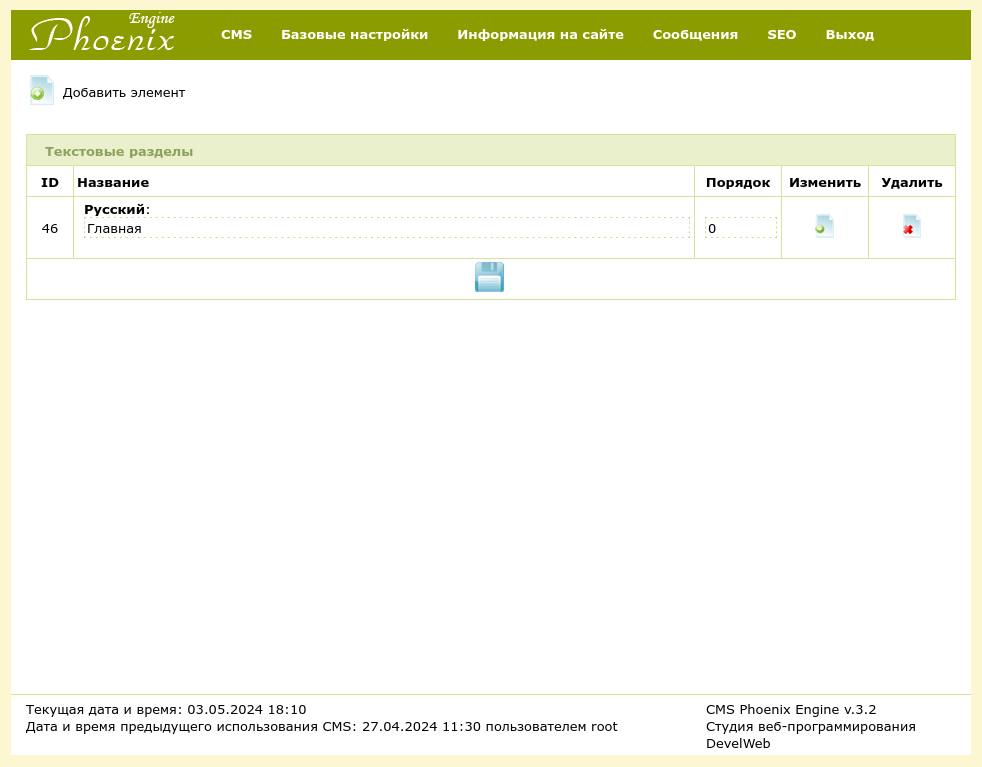
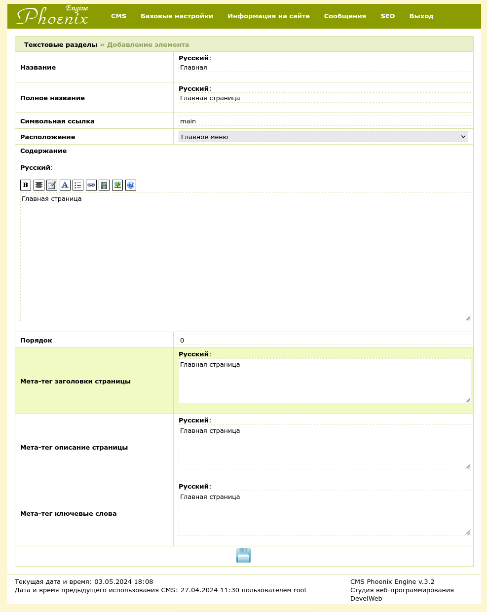

# CMSEngine

Lightweight cms engine on perl

### Features:
1. Text sections
2. Hierachical catalog
3. SEO optimization
4. Multi-languages support

### Screenshots:

### Run in docker:
1. docker build --pull --rm -f "Dockerfile" -t izemskov:latest "."
2. docker run -p82:80 --add-host host.docker.internal:host-gateway izemskov:latest
